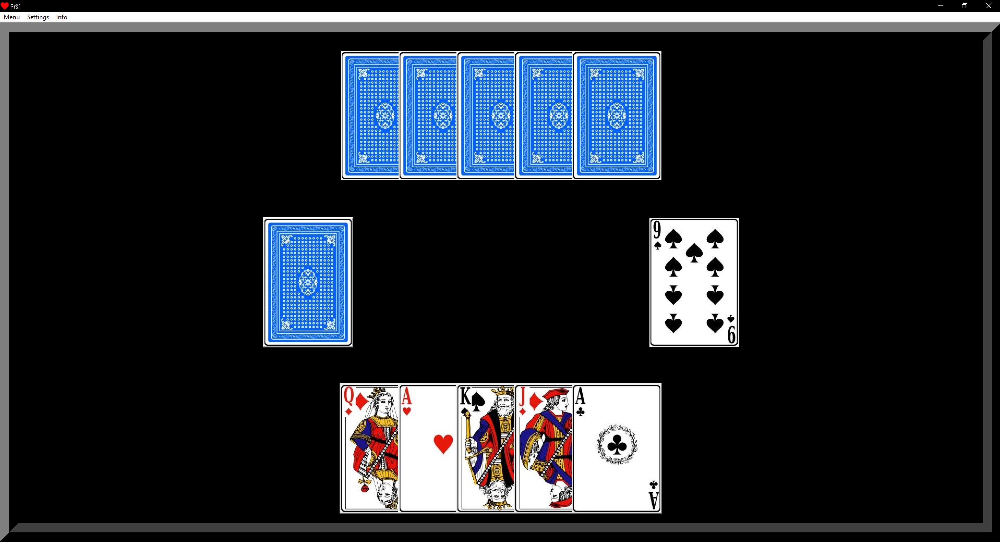

# Prší card game

## Game rules:
Old school European card game, where players start with hand of 5 cards and have to end up with empty hands.  
Additionally, here, added a rule to keep the game progressing based on the outcome of each round.

- your opponent is computer here
- no animations
- winner of the round plays with one card less and loser gets one more, on the start of next round

## Project structure:
Game runs from mainloop in main.py. Back bone is in core.py which has two classes - Graphical user interface and Logic. Supporting classes are imported into core.py.

## Todo:
- fix redrawing images to avoid flickering.
- change style of cards without restarting the program

## Status of the project:
Functional

## Result:

